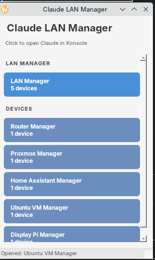

# Claude LAN Manager

GUI launcher for managing local network computers using Claude Code as the AI agent. Creates isolated "Claude Spaces" with dedicated MCP configurations for each device or device group.



## How It Works

```
┌─────────────────────────────────────────────────────────────────┐
│                     Your Workstation                            │
│  ┌──────────────────┐    ┌─────────────────────────────────┐   │
│  │ Claude LAN       │───▶│ Claude Code                     │   │
│  │ Manager (GUI)    │    │ (launches in isolated space)    │   │
│  └──────────────────┘    └─────────────────────────────────┘   │
└─────────────────────────────────────────────────────────────────┘
                                    │
                         MCP (Streamable HTTP)
                                    │
        ┌───────────────────────────┼───────────────────────────┐
        ▼                           ▼                           ▼
┌───────────────┐          ┌───────────────┐          ┌───────────────┐
│ Router        │          │ Home Server   │          │ Raspberry Pi  │
│ 10.0.0.1:3001 │          │ 10.0.0.4:3000 │          │ 10.0.0.63:3000│
│ [MCP Server]  │          │ [MCP Server]  │          │ [MCP Server]  │
└───────────────┘          └───────────────┘          └───────────────┘
```

Each device runs a lightweight MCP server that accepts commands from Claude. The GUI launcher ensures Claude only connects to the MCPs for the selected space—no accidental cross-device access.

---

## Setup Guide

There are three stages to setting up Claude LAN Manager:

### Stage 1: LAN MCP Propagation

Install lightweight MCP servers on each device you want to manage.

**What the MCP server does:** Converts Claude's tool calls into shell commands on the remote machine. It's essentially an SSH replacement with lower overhead, especially useful for constrained devices like Raspberry Pis.

**Example MCP server** is provided in [`examples/simple-mcp-server/`](examples/simple-mcp-server/):

```bash
# On each target device
pip install "mcp[server]"

# Download the server script
curl -O https://raw.githubusercontent.com/danielrosehill/claude-lan-manager/main/examples/simple-mcp-server/server.py

# Run it (customize port as needed)
PORT=3000 python server.py
```

For production use, run as a systemd service. See [examples/simple-mcp-server/README.md](examples/simple-mcp-server/README.md) for details.

**Security note:** These MCP servers have no authentication and execute arbitrary commands. Only run on trusted local networks.

### Stage 2: Configure Your Devices and Spaces

1. **Clone and set up the manager:**

```bash
git clone https://github.com/danielrosehill/claude-lan-manager.git
cd claude-lan-manager
uv sync
```

2. **Create your configuration:**

```bash
cp config/config.example.yaml config/config.yaml
```

3. **Edit `config/config.yaml`** with your network devices:

```yaml
# Where space data is stored (kept separate from code)
spaces_base_path: ~/.local/share/claude-lan-manager/spaces

# Terminal to use
terminal_emulator: konsole

# Your network devices
devices:
  - id: router
    name: Ubuntu Router
    ip: 10.0.0.1
    mcp_port: 3001
    description: Network gateway (DHCP/DNS)

  - id: homeserver
    name: Home Server
    ip: 10.0.0.4
    mcp_port: 3000
    description: Main home server

  - id: pi
    name: Raspberry Pi
    ip: 10.0.0.63
    mcp_port: 3000
    description: Alarm panel display

# Define your spaces (which devices each assistant can access)
spaces:
  # One assistant for everything
  - id: lan-manager
    name: LAN Manager
    devices: [router, homeserver, pi]
    category: consolidated

  # Individual device managers
  - id: homeserver-manager
    name: Home Server Manager
    devices: [homeserver]
    category: individual

  - id: pi-manager
    name: Pi Manager
    devices: [pi]
    category: individual
```

4. **Initialize the spaces:**

```bash
uv run claude-lan-manager-setup init
```

This creates the directory structure:

```
~/.local/share/claude-lan-manager/spaces/
├── lan-manager/
│   ├── CLAUDE.md       # Context: "You manage all devices..."
│   ├── .mcp.json       # MCP config with all 3 devices
│   └── logs/
├── homeserver-manager/
│   ├── CLAUDE.md       # Context: "You manage the home server..."
│   ├── .mcp.json       # MCP config with just homeserver
│   └── logs/
└── pi-manager/
    ├── CLAUDE.md       # Context: "You manage the Raspberry Pi..."
    ├── .mcp.json       # MCP config with just pi
    └── logs/
```

### Stage 3: Launch the Manager

```bash
uv run claude-lan-manager
```

Click any button to launch Claude Code in an isolated space with only the configured MCPs.

---

## Key Concepts

### Claude Spaces

A "Claude Space" is a directory containing:
- `CLAUDE.md` - Role and context for the assistant
- `.mcp.json` - MCP configuration (auto-generated from your config)
- `logs/` - Persistent logging folder

### MCP Isolation

The critical feature is **strict MCP isolation**. When you click a button:

1. Claude Code launches with `--strict-mcp-config --mcp-config <space>/.mcp.json`
2. Claude ONLY sees the MCPs defined in that file
3. User-level MCPs are NOT loaded

This prevents accidental cross-device access and keeps each assistant focused.

### Data Separation

- **Code repository** - This repo (can be public)
- **Spaces data** - `~/.local/share/claude-lan-manager/spaces/` (private, contains network details)
- **Config file** - `config/config.yaml` (gitignored)

---

## Commands Reference

```bash
# Launch the GUI
uv run claude-lan-manager

# Setup utilities
uv run claude-lan-manager-setup init          # Initialize spaces
uv run claude-lan-manager-setup init --force  # Regenerate all files
uv run claude-lan-manager-setup show-config   # Show current config
uv run claude-lan-manager-setup copy-config   # Copy example config
```

---

## Requirements

- Python 3.12+ (via `uv`)
- Claude Code CLI (`claude`)
- Terminal emulator (default: `konsole` for KDE)
- MCP servers running on target devices

---

## MCP Server Reference

Each managed device needs an MCP server with:

| Requirement | Value |
|------------|-------|
| Transport | Streamable HTTP |
| Endpoint | `http://{IP}:{PORT}/mcp` |
| Authentication | None (local network only) |

See [`examples/simple-mcp-server/`](examples/simple-mcp-server/) for a ready-to-use implementation.

---

## License

MIT
